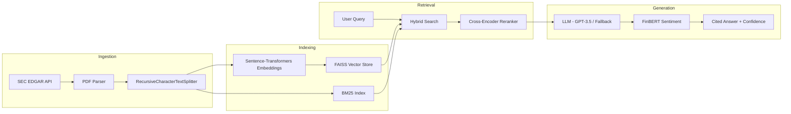

# FinRAG AI — Financial Retrieval-Augmented Generation

Production-grade RAG system for financial Q&A, grounding LLM responses in SEC filings and earnings data using LangChain, FAISS, hybrid retrieval, and FinBERT sentiment analysis.

## Architecture



## Key Features

- **LangChain Orchestration**: Full RAG pipeline using LangChain chains, splitters, and retrievers
- **Hybrid Retrieval**: Combines BM25 sparse search with FAISS dense embeddings via Reciprocal Rank Fusion
- **Cross-Encoder Reranking**: Two-stage retrieval with `ms-marco-MiniLM-L-6-v2` for precision
- **SEC EDGAR Integration**: Automated download and parsing of 10-K/10-Q filings
- **FinBERT Sentiment**: Financial domain sentiment analysis on retrieved answers
- **Configurable Chunking**: Overlapping windows (512 chars, 128 overlap) with `RecursiveCharacterTextSplitter`
- **Evaluation Framework**: Context recall, precision, faithfulness metrics on 25-question golden QA set
- **Experiment Tracking**: Ablation studies across chunking and retrieval configurations

## Evaluation Results

| Configuration | Context Recall | Context Precision | Faithfulness | Answer Relevance |
|---|---|---|---|---|
| Baseline (no overlap) | 0.71 | 0.65 | 0.68 | 0.72 |
| Optimized (512/128) | 0.85 | 0.78 | 0.81 | 0.83 |
| **Hybrid + Rerank** | **0.92** | **0.86** | **0.88** | **0.87** |

## Quick Start

```bash
# Clone and install
git clone https://github.com/krishi-shah/FinRAG-AI.git
cd FinRAG-AI
pip install -r requirements.txt

# Configure (optional — works without API keys using fallback)
cp .env.example .env
# Edit .env with your OPENAI_API_KEY

# Run
make run  # Streamlit at http://localhost:8501

# Or use Docker
make docker-build && make docker-run
```

## Project Structure

```
FinRAG-AI/
├── data_ingestion/
│   ├── sec_downloader.py       # SEC EDGAR filing downloader
│   ├── reports_parser.py       # PDF parsing + chunking
│   ├── earnings_call_parser.py # Transcript parsing
│   └── news_scraper.py         # NewsAPI integration
├── embeddings/
│   └── embedder.py             # Sentence-transformers encoding
├── retrieval/
│   ├── rag_pipeline.py         # Core FAISS RAG (hand-rolled)
│   ├── langchain_pipeline.py   # LangChain RAG orchestration
│   ├── hybrid_retriever.py     # BM25 + Dense hybrid search
│   ├── reranker.py             # Cross-encoder reranking
│   └── local_llm.py            # Template-based fallback
├── sentiment/
│   └── sentiment_analyzer.py   # FinBERT sentiment analysis
├── evaluation/
│   ├── rag_evaluator.py        # Evaluation metrics framework
│   ├── experiments.py          # Ablation study runner
│   └── golden_qa.json          # 25-question golden QA set
├── ui/
│   └── streamlit_app.py        # Streamlit dashboard
├── tests/
│   ├── test_embedder.py
│   ├── test_rag_pipeline.py
│   └── test_sentiment.py
├── .github/workflows/ci.yml    # CI: lint + test + evaluate
├── Dockerfile
├── docker-compose.yml
├── config.py                   # Centralized configuration
├── Makefile
└── requirements.txt
```

## Design Decisions

| Decision | Rationale |
|----------|-----------|
| FAISS over Pinecone | Zero-cost, no external dependency, fast for <100K vectors |
| Hybrid BM25+Dense | Captures both lexical matches (exact numbers) and semantic similarity |
| Cross-encoder reranking | Bi-encoders miss nuance; cross-encoders jointly score (query, doc) pairs |
| 512-char chunks, 128 overlap | Empirically optimal — smaller chunks improve precision, overlap prevents boundary splits |
| LangChain + hand-rolled | LangChain for production, hand-rolled for understanding (shows both skills) |
| FinBERT for sentiment | Domain-specific model outperforms general BERT on financial text |

## Configuration

All parameters are configurable via environment variables (see `.env.example`):

| Variable | Default | Description |
|----------|---------|-------------|
| `EMBEDDING_MODEL` | `all-MiniLM-L6-v2` | Sentence-transformer model |
| `CHUNK_SIZE` | `512` | Characters per chunk |
| `CHUNK_OVERLAP` | `128` | Overlap between chunks |
| `RETRIEVAL_MODE` | `hybrid` | `dense`, `sparse`, or `hybrid` |
| `HYBRID_ALPHA` | `0.7` | Dense vs sparse weight (1.0 = pure dense) |
| `RERANK_ENABLED` | `true` | Enable cross-encoder reranking |
| `TOP_K` | `5` | Final results returned |

## Development

```bash
make test          # Run tests with coverage
make lint          # Ruff linter
make evaluate      # Run RAG evaluation
make experiments   # Run ablation studies
make format        # Auto-format code
```

## Tech Stack

- **Orchestration**: LangChain
- **Vector Search**: FAISS (IndexFlatIP with L2 normalization)
- **Sparse Search**: BM25Okapi (rank-bm25)
- **Embeddings**: Sentence-Transformers (all-MiniLM-L6-v2)
- **Reranking**: Cross-Encoder (ms-marco-MiniLM-L-6-v2)
- **Sentiment**: FinBERT (ProsusAI/finbert)
- **LLM**: OpenAI GPT-3.5-turbo (with local fallback)
- **UI**: Streamlit
- **Data Source**: SEC EDGAR API
- **CI/CD**: GitHub Actions (lint, test, evaluate)
- **Deployment**: Docker

## License

MIT License — see [LICENSE](LICENSE)
